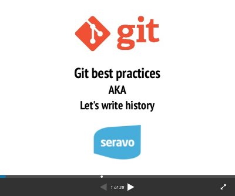

# Gnitpick

Git commit message [nitpicker](https://en.wiktionary.org/wiki/nitpick). Makes sure all future git commit messages are perfect!

## Why?

Even though [git](https://git-scm.com/) has been around now for 15+ years and is the de-facto solution for version control in all modern software projects, developers and contributors in software projects do not intuitively seem to grasp the best practices in building software patch-by-patch and describing the WHAT and WHY for each step.

Senior developers should not spend too much time on teaching juniors on how to make sensible git commit messages. We simply suggest you make your team read any of the excellent git commit title/message articles out there and then enforce following them by applying Gnitpick to your git repository CI pipeline.

#### Recommended reads

* https://chris.beams.io/posts/git-commit/
* https://github.com/erlang/otp/wiki/writing-good-commit-messages
* https://brigade.engineering/the-secrets-to-great-commit-messages-106fc0a92a25
* https://dev.to/jacobherrington/how-to-write-useful-commit-messages-my-commit-message-template-20n9
* https://git-scm.com/book/en/v2/Distributed-Git-Contributing-to-a-Project

See also a basic presentation on git best practices on Slideshare:

..or the extended 3 hour workshop version with 70 slides:

.

## Usage

In you git pre-commit hook or CI system, simply run:

    python3 /path/to/gnitpick.py

### Local git hook

See `git-hooks/pre-push` as an example.

### Travis-CI

Simply add this to your `.travis.yml` file:

    - curl -O https://raw.githubusercontent.com/Seravo/gnitpick/master/gnitpick.py
    - python3 ./gnitpick.py

## Development status

Early stages... Pull requests welcome!

## License

This script is published under GPLv3. Feel free to use. Contributions welcome!
