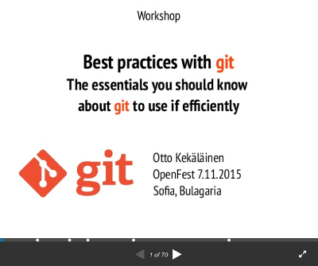

# Gnitpick

Git commit message [nitpicker](https://en.wiktionary.org/wiki/nitpick). Makes sure all future git commit messages are perfect!

Example:
```
$ gnitpick

Gnitpick inspecting git revisions range origin/master..HEAD
commit 32f0d152f2985b95c43e3cd79caa18104d32f413
Author: Otto Kekäläinen <otto@kekalainen.net>
Date:   Mon Jun 29 10:54:45 2020 +0300

    update readme with description about how to install this project on a local development environment.

Inspecting commit 32f0d152f2985b95c43e3cd79caa18104d32f413:
Gnitpick commit inspection did not pass!

Fix these fails and try again:
- 32f0d152: Commit message title ends in a period character
- 32f0d152: Commit message title is over 72 characters
- 32f0d152: Commit message title does not start with an uppercase letter

Read more about about git best practices at
https://github.com/Seravo/gnitpick#recommended-reads
```

## Why?

Even though [git](https://git-scm.com/) has been around now for 15+ years and is the de-facto solution for version control in all modern software projects, developers and contributors in software projects do not intuitively seem to grasp the best practices in building software patch-by-patch and describing the WHAT and WHY for each step.

Senior developers should not spend too much time on teaching juniors on how to make sensible git commit messages. We simply suggest you make your team read any of the excellent git commit title/message articles out there and then enforce following them by applying Gnitpick to your git repository CI pipeline.

#### Recommended reads

* https://chris.beams.io/posts/git-commit/
* https://github.com/erlang/otp/wiki/writing-good-commit-messages
* https://brigade.engineering/the-secrets-to-great-commit-messages-106fc0a92a25
* https://dev.to/jacobherrington/how-to-write-useful-commit-messages-my-commit-message-template-20n9
* https://git-scm.com/book/en/v2/Distributed-Git-Contributing-to-a-Project

See also a basic presentation on git best practices on Slideshare:

[](https://www.slideshare.net/ottokekalainen/git-best-practices-2016)


..or the extended 3 hour workshop version with 70 slides:

[](https://www.slideshare.net/ottokekalainen/git-best-practices-workshop).


## Installation and usage

Install Gnitpick globally with:

    curl -sS https://raw.githubusercontent.com/Seravo/gnitpick/master/gnitpick.py -o /usr/bin/gnitpick
    chmod +x /usr/bin/gnitpick

To launch it, simply run it you git repository directory:

    $ gnitpick
    Gnitpick inspecting git revisions range origin/master..HEAD
    No commits in range origin/master..HEAD
    Using origin/master..HEAD instead.

    Gnitpick commit inspection passed!


### Local git hook

See `git-hooks/pre-push` as an example.

### Travis-CI

Simply add this to your `.travis.yml` file:

    - curl -O https://raw.githubusercontent.com/Seravo/gnitpick/master/gnitpick.py
    - python3 ./gnitpick.py

### Live examples

For live examples, see the [Makefile in Fevermap](https://gitlab.com/fevermap/fevermap/-/blob/master/Makefile#L23) or the [.gitlab-ci.yml in Fevermap](https://gitlab.com/fevermap/fevermap/-/blob/master/.gitlab-ci.yml#L15-23) or the [.travis.yml in Seravo Plugin](https://github.com/Seravo/seravo-plugin/blob/master/.travis.yml#L19-L25.)

## Development status

Early stages... Pull requests welcome!

## License

This script is published under GPLv3. Feel free to use. Contributions welcome!
